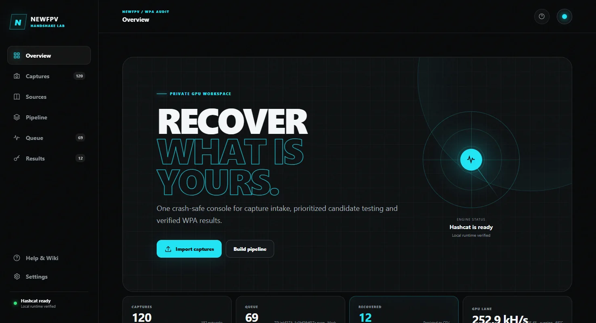
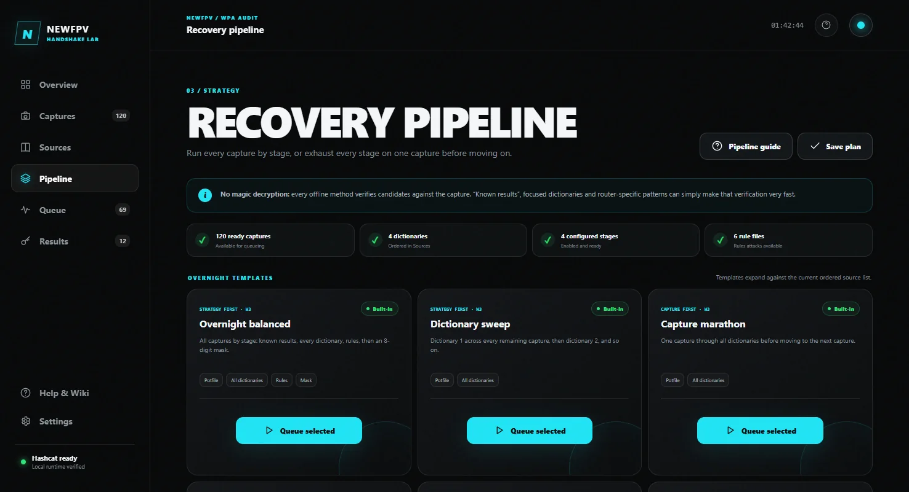
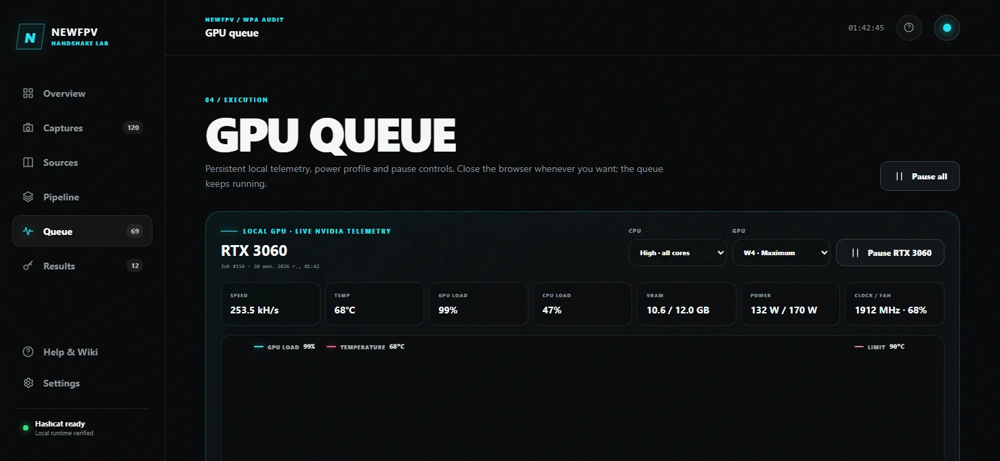

# Handshake Lab


A local-first control room for authorized WPA/WPA2 credential audits. Import captures, build ordered recovery pipelines, run persistent Hashcat queues, watch every GPU, and keep verified results in one responsive NewFPV interface.

> Use this software only on networks you own or have explicit authorization to test.



## Why Handshake Lab

- **One-click Windows startup.** Python, Hashcat and capture-conversion tools are installed locally when missing.
- **Persistent overnight queues.** Pause, resume, reorder, retry and return after closing the browser.
- **Useful pipelines.** Known results, ranked common candidates, Pattern Builder, dictionaries, rules, hybrid and mask stages.
- **No repeated work.** Capture deduplication, per-network attempt memory and cascading dictionary deduplication.
- **Wordlist Analyzer.** Stream multi-gigabyte dictionaries and count WPA-ready candidates, duplicates, short lines and estimated GPU time.
- **One-click Error Doctor.** Recognize missing tools/files, CUDA RTC, VRAM, OpenCL and damaged capture failures with safe fixes.
- **Real observability.** Speed, ETA, GPU load, temperature, VRAM, power, clock and fan history.
- **Instant live GPU profiles.** Switch W1–W4 without restarting Hashcat or losing the current candidate position.
- **Built-in benchmark.** Measure WPA 22000 performance in an exclusive W4 run and keep the latest result for comparison.
- **Useful notifications.** Native Handshake Lab Windows toasts and optional Telegram alerts for recovered keys, heat, worker failures and completed queues.
- **Telegram control panel.** Inline buttons show GPU/queue status, pause or resume all work, switch live W1–W4 profiles, display recovered keys and import PCAP/candidate files from one approved chat.
- **Two-PC mode.** Authenticated LAN workers use separate queues, telemetry, pause controls and power profiles.
- **Crash-aware storage.** SQLite WAL/FULL writes, flushed result exports, Hashcat restore sessions and portable backups.
- **Private by default.** The UI has no CDN, analytics or remote fonts. Captures and recovered keys stay local; Telegram is completely inactive unless explicitly configured.

| Recovery pipeline | Independent GPU lanes |
|---|---|
|  |  |

## Quick start

### Option 1 — one PowerShell command

Open PowerShell and run:

```powershell
irm https://raw.githubusercontent.com/newfpv/handshake-lab/main/install.ps1 | iex
```

The installer downloads the latest release into `%LOCALAPPDATA%\NewFPV\HandshakeLab`, preserves existing settings during updates, and starts the app.

### Option 2 — portable ZIP

1. Download `NewFPV-Handshake-Lab-portable.zip` from the latest GitHub release.
2. Extract it to a local folder with write access.
3. Double-click `start.bat`.
4. Keep the first-launch window open while dependencies are prepared.

The browser opens at [http://127.0.0.1:8787](http://127.0.0.1:8787). Later launches reuse the background service. `stop.bat` performs a safe checkpoint-aware shutdown.

### First audit

1. Open **Captures** and add `.22000`, `.hc22000`, `.pcap`, `.pcapng`, or `.cap` files.
2. Open **Candidate sources** and add wordlists or Hashcat `.rule` files.
3. Open **Recovery pipeline**, choose a template, select ready captures, and queue the plan.
4. Watch progress in **GPU queue** and verified matches in **Recovered keys**.

The app excludes captures whose networks already have verified passwords and remembers unsuccessful source/method fingerprints so unchanged work can be skipped safely.

## Live controls, notifications and remote access

### Instant W1–W4 profiles

Change the local GPU profile from **GPU queue** while a job is running. Handshake Lab changes the duty cycle of the existing Hashcat process, so the PID, restore session and exact candidate position remain intact. LAN workers receive live GPU-profile changes through their control channel. CPU-device changes apply to the next job because Hashcat cannot safely add or remove a backend device mid-session.

Use **Pause all** as the master switch, or pause each online computer independently. Offline LAN workers and their telemetry are hidden from the dashboard and queue.

### Benchmark and alerts

Open **Settings → Audit engine → Benchmark** to run an exclusive Hashcat mode 22000 benchmark. The queue is held for the measurement and returns to its previous pause state afterwards.

Windows notifications are local native toasts with the Handshake Lab identity and logo. Telegram is disabled until a bot token and chat ID are saved. **Test alerts** verifies every enabled channel; individual Windows and Telegram test buttons are available beside their settings.

Send `/start` to the configured bot for its inline control panel. It provides live status, queue, recovered results, master pause/resume, W1–W4 and upload/help buttons. Telegram file intake is separately opt-in. When enabled, the exact configured chat may send `.pcap`, `.pcapng`, `.cap`, `.22000`, `.hc22000`, dictionaries and `.rule` documents up to 20 MB. PCAP files pass through the normal local conversion, quality and deduplication flow and are never queued automatically.

### Public-IP web access

Remote access is private and disabled by default. In **Settings → Public-IP access**:

1. Set a username and a new password of at least 12 characters.
2. Enable remote access, save, and restart Handshake Lab if the listener changed.
3. Put the trusted external HTTPS address from your domain, reverse proxy or VPN share into **HTTPS public URL for Telegram Web App**.
4. Press **Check address**. The bot then adds **Open Handshake Lab** to its inline panel and persistent Telegram menu.
5. Forward a proxy port on the router only when direct hosting is required; tunnels and VPN shares normally need no inbound forwarding.

Public browser clients use the responsive Handshake Lab sign-in screen, a rate-limited seven-day session and an explicit Sign out action. Scripted API clients may still use HTTP Basic credentials. Cross-origin write requests are rejected. Telegram Mini Apps require HTTPS, so Handshake Lab rejects plain HTTP and embedded credentials in the trusted URL field. Handshake Lab never enables UPnP or changes the router automatically.

For temporary personal use, **Self-signed HTTPS** can keep HTTP on `8787` and start a second encrypted listener on `8788`. Forward the second port separately. The certificate includes the current public and local addresses but is not trusted by browsers or Telegram, so warnings or Mini App rejection are expected. A trusted URL always takes priority when configured.

## Requirements

- Windows 10 or Windows 11 x64
- Internet access for the first dependency bootstrap
- A current GPU driver supported by Hashcat
- Local disk space for captures, wordlists and restore sessions

Python 3.11 and Hashcat 7.1.2 are installed under the application directory only when compatible tools are unavailable. Download archives, installers and extraction residue are removed automatically after verification.

## Built-in Help & Wiki

The exhaustive documentation lives inside the app under **Help & Wiki**. It is searchable and covers:

- capture states and quality diagnostics;
- source ordering, cleanup and cascade deduplication;
- Wordlist Analyzer metrics, streaming behavior and ETA;
- every pipeline stage, mask syntax and Pattern Builder;
- overnight queues, checkpoints, per-job active elapsed time, remaining-time estimates and GPU/CPU profiles;
- local files, backups, restores and PWMenu-compatible `recovered.csv` exports;
- complete two-computer LAN setup;
- live W1–W4 behavior and the exclusive WPA benchmark;
- native Windows alerts, Telegram controls, PCAP intake, Mini App setup and notification testing;
- authenticated public-IP access, HTTPS/VPN guidance and troubleshooting;
- Error Doctor diagnostics with exact failure meanings.

README stays intentionally short so installation is obvious; the built-in Wiki is the authoritative operating manual and is available offline.

## LAN worker in 60 seconds

1. On the coordinator, set the listener to `0.0.0.0`, enable authenticated workers, save, and restart the app.
2. Allow TCP `8787` only on the Windows **Private** firewall profile.
3. Copy the portable release to PC 2 and run `start-worker.bat` once.
4. Put the coordinator URL, generated token and candidate-source folders into `lan-worker.json`.
5. Run `start-worker.bat` again.

The coordinator shows a worker only while its heartbeat is online. Offline worker cards and telemetry disappear automatically. Each connected worker sends idle and active NVIDIA telemetry and has independent CPU/GPU profiles. See **Help & Wiki → Two computers on one LAN** for the secure full procedure.

## Local data

| Path | Purpose |
|---|---|
| `captures/` | Imported packet captures |
| `hashes/` | Normalized Hashcat 22000 data |
| `wordlists/`, `rules/` | Candidate sources |
| `data/newfpv_audit.db` | Queue, results, settings memory and telemetry |
| `data/recovered.csv` | Flushed readable result export |
| `data/hashcat.potfile` | Hashcat verified-result cache |
| `logs/` | Converter, job and service diagnostics |
| `sessions/` | Hashcat restore checkpoints |

These paths and `config.json` are ignored by Git and excluded from source releases.

## Development and release

```powershell
python -m pip install -r requirements-dev.txt
python -m unittest discover -s tests -p "test_*.py"
.\release.bat
```

`release.ps1` runs syntax checks and the test suite, creates the clean portable archive, and writes its SHA-256 checksum under `dist/`. Downloaded runtimes, private settings, captures, passwords, wordlists and logs are never added to the source package.

## License

[MIT](LICENSE) © 2026 NewFPV. Product design and documentation by [NewFPV](https://neewfpv.com/).
